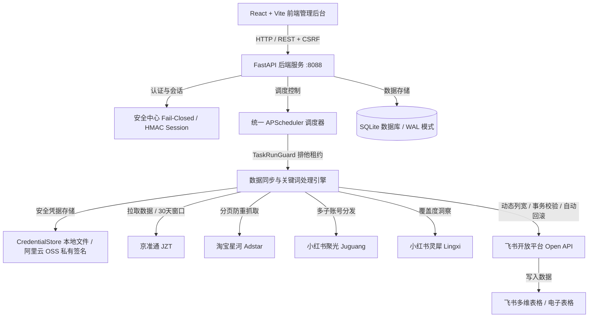

# 电商数据自动同步与监控看板系统 (JFJLL/automation)

自动化同步京准通 (JZT)、淘宝星河 (Taobao)、小红书聚光 (Juguang) 投放数据及小红书灵犀人群关键词数据至飞书多维表格与电子表格。

## 1. 系统架构



## 2. 本地快速启动

### 2.1 后端服务启动
```bash
# 1. 激活虚拟环境并安装依赖
python -m venv .venv
.\.venv\Scripts\activate  # Windows
pip install -r requirements.txt  # 或 pip install -e ".[dev]"

# 2. 配置环境变量
cp sync_console/.env.example sync_console/.env
# 编辑 sync_console/.env 配置 FEISHU_APP_ID, FEISHU_APP_SECRET, SESSION_SECRET(>=32位)

# 3. 运行本地后端 (统一端口 8088)
python sync_console/run_local.py
# 或 python -m uvicorn app.main:app --app-dir sync_console --host 127.0.0.1 --port 8088
```

### 2.2 前端启动与构建
```bash
cd frontend
npm ci
npm run dev   # 本地开发模式 (默认 5173，反向代理至 8088)
npm run build # 生产构建打包 (产物位于 frontend/dist)
```

## 3. 环境变量全量说明

| 变量名 | 说明 | 默认值 / 约束 |
|---|---|---|
| `SESSION_SECRET` | 会话 HMAC 签名核心密钥 | **必填，且必须 >= 32 字符** |
| `ACCESS_TOKEN` | 系统管理员初始口令 | 用于后台登录密码验证 |
| `AUTH_MODE` | 鉴权模式 | `token` (默认)。设置为 internal 仅在 ALLOW_INTERNAL_AUTH=1 下有效 |
| `COOKIE_SECURE` | Cookie Secure 传输标记 | 生产环境设为 `true` |
| `FEISHU_APP_ID` | 飞书开放平台应用 App ID | 必填 |
| `FEISHU_APP_SECRET` | 飞书开放平台应用 App Secret | 必填 |
| `FEISHU_SHEET_SHARE_MODE` | 新建飞书表格默认权限 | 默认为 `private`，可选 `tenant_readable` / `tenant_editable` |
| `MISSED_RUN_POLICY` | 停机后错失运行策略 | 默认为 `run_once`，可选 `skip` |
| `SHARED_FOLDER_TOKEN` | 飞书共享云文档空间 Token | 选填，留空自动在根目录创建 |
| `SHARED_FOLDER_NAME` | 飞书共享文件夹名称 | 默认 "数据自动同步表" |
| `OSS_ENDPOINT` | 阿里云 OSS 地域节点 | 默认 "https://oss-cn-beijing.aliyuncs.com" |
| `OSS_BUCKET` | 阿里云 OSS 存储桶名称 | 默认 "redmagic" (建议设为私有 Bucket) |
| `OSS_ACCESS_KEY_ID` | 阿里云访问密钥 ID | 具有读取 Token 权限的 RAM AK |
| `OSS_ACCESS_KEY_SECRET` | 阿里云访问密钥 Secret | 具有读取 Token 权限的 RAM SK |
| `CREDENTIALS_DIR` | 本地安全凭据目录 | 默认 `sync_console/tokens/`，POSIX 权限 0600 |
| `TIMEZONE` | 业务统一时区 | 默认 `Asia/Shanghai` |

## 4. 测试与代码验证

```bash
# 运行后端单元测试 (排除需要本地真实浏览器驱动的 e2e 测试)
python -m pytest -q

# 运行代码规范检查
ruff check .

# 运行前端单元测试与构建检查
cd frontend && npx vitest run && npm run build
```

## 5. 凭据管理与安全规范
- **禁止明文存储凭据**：任何真实的 Token、Cookie、Secret 严禁提交至 Git 仓库，统一通过 `.gitignore` 屏蔽；
- **统一凭据中枢**：平台凭据通过 `core/credentials.py::CredentialStore` 获取，依次优先从本地安全目录与私有 OSS 签名接口读取；
- **防路径遍历与大小限制**：凭据名严格匹配 `^[a-zA-Z0-9_-]{1,64}$`，单项凭据载荷限制 64KB；
- **日志严格脱敏**：系统日志中只输出 Cookie 长度与 SHA-256 前 8 位指纹，绝不回显任何敏感明文片段。
